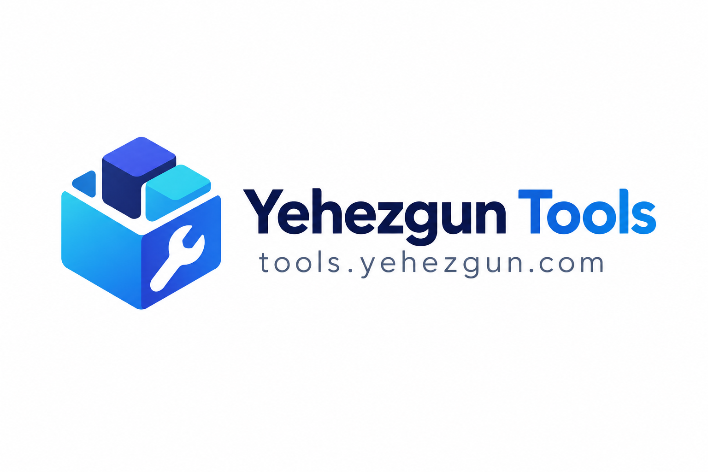

# Yehezgun Tools

<p align="center">
  
</p>

Small browser-first utilities for everyday work.

## Local Development

Install dependencies:

```bash
pnpm install
```

Start the development server at `http://localhost:3000`:

```bash
pnpm run dev
```

Run the local quality gates:

```bash
pnpm run check
pnpm run lint
pnpm run typecheck
pnpm run test
pnpm run build
```

Preview the production build locally:

```bash
pnpm run preview
```

## Routes

- `/` - available tools
- `/generator/whatsapp-link` - WhatsApp link generator
- `/developer/json-formatter` - JSON formatter

Unknown routes show a 404 page. Tool modules are lazy-loaded so new tools do not need to be included in the initial route bundle.

## Social Metadata

The homepage emits the default SEO and Open Graph tags at build time. The Worker rewrites those tags for every registered tool route before serving the SPA shell, so social crawlers receive the correct title, description, canonical URL, and image without running React.

OG images are generated by [og-image-rev](https://og-image-rev.yehezgun.com/) and use the public square logo at `/yehezgun-tools-og-logo.png`. The build regenerates that logo from the favicon with `pnpm run generate:og-logo`. Adding a tool to `src/tools/registry.ts` automatically gives it route-specific metadata and an OG image.

## Privacy

The WhatsApp Link Generator and JSON Formatter run entirely in the browser. Phone numbers, messages, and JSON input are not sent to an application server or external API.

## Deployment

The application is configured for Cloudflare Workers Static Assets in `wrangler.jsonc`.

The deployment workflow is intentionally manual and only runs when dispatched from the `main` branch. It runs all quality gates, builds `dist`, and deploys the assets with Wrangler.

Configure these GitHub repository secrets before dispatching `.github/workflows/deploy.yml`:

- `CLOUDFLARE_ACCOUNT_ID`
- `CLOUDFLARE_API_TOKEN`

The Wrangler configuration enables SPA fallback for direct route refreshes, runs the metadata Worker first for document routes, and maps the Worker to `tools.yehezgun.com` as a custom domain. The Cloudflare zone and DNS record must be available in the account before the first deployment.
